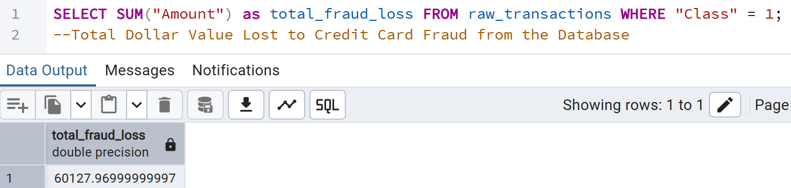
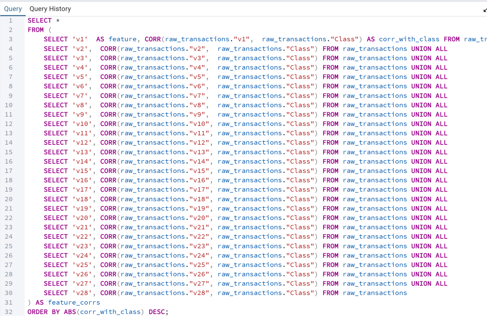

**Lukas Derasmo**  
**Credit Card Fraud Data Analysis**  
**Data: Credit Card Fraud Detection**  
(Anonymized credit card transactions labeled as fraudulent or genuine)  
Source: Kaggle ([https://www.kaggle.com/datasets/mlg-ulb/creditcardfraud/data](https://www.kaggle.com/datasets/mlg-ulb/creditcardfraud/data))

**Intelligence Brief**  
Develop a counter-fraud intelligence workflow to detect illicit financial patterns within a dataset of 284,807 European credit card transactions. Utilizing PCA-transformed features to maintain GDPR/PII compliance, the system identified $60,127 in fraudulent exposure across 492 confirmed cases. The investigation revealed distinct temporal attack vectors (late-night velocity spikes) and transaction structuring behaviors (averaging $122.21 per fraud instance vs. $88.29 for legitimate use), enabling targeted risk mitigation strategies.

**Data Source & Anonymization Protocols**  
The dataset comprises 284,807 individual transactions in 2013 from European cardholders. To comply with privacy standards, the source data was subjected to anonymization before being published:

* 28 highly sensitive user features (e.g., identity, location, device telemetry) were mathematically transformed using Principal Component Analysis (PCA) into numerical vectors (V1 – V28). This preserves the statistical variance and correlation structures needed for pattern recognition while stripping away identifiers.  
* Absolute timestamps were removed and replaced with a "Time" delta (seconds elapsed since the initial dataset entry), allowing for time-based pattern analysis without revealing specific dates or individual user schedules.  
* Only two operational metrics, being Amount and Class (eg.- Fraudulent/Legitimate), were retained in their original format. Class takes the value of 1 in a case of fraud, 0 otherwise.

**Operational Objectives**

* Architect a PostgreSQL data warehouse to manage raw transaction logs.  
* Apply statistical logic to masked PCA features to uncover hidden fraud vectors.  
* Deploy a Power BI operational dashboard to monitor financial exposure and fraud velocity.

**Note**

* The dataset is highly unbalanced, the positive class (frauds) account for less than 1 percent of all transactions.

Preliminary Information Queries

Before moving to Power BI, it is important to complete some initial queries to understand themes from the data that could be used in the visualization.

*“What is the total amount lost to fraud?”*  

*“Does fraud occur at particular times?”*  

Preliminary Information Queries, Contd.

*"Are fraudsters stealing small amounts to stay under the radar, or going for big hits?"*

| transaction\_type | transaction\_count | avg\_dollar\_total | max\_dollar\_total |
| :---- | :---- | :---- | :---- |
| Legitimate | 284315 | 88.29 | 25691.16 |
| Fraudulent | 492 | 122.21 | 2125.87 |

Preliminary Information Queries, Contd.

**Importance Analysis:** *“Which features are most strongly correlated with fraud?”*

| feature | corr\_with\_class |
| :---- | :---- |
| v17 | \-0.3264810672437161 |
| v14 | \-0.3025436958044087 |
| v12 | \-0.260592924877223 |
| v10 | \-0.2168829436410348 |
| v16 | \-0.19653894030401992 |
| v3 | \-0.19296082706742446 |
| v7 | \-0.18725659151429705 |
| v11 | 0.15487564474394844 |
| v4 | 0.13344748623900285 |
| v18 | \-0.11148525388904748 |
| v1 | \-0.10134729859508414 |
| v9 | \-0.09773268607408156 |
| v5 | \-0.09497429899144745 |
| v2 | 0.09128865034461985 |
| v6 | \-0.043643160699962845 |
| v21 | 0.040413380610575284 |
| v19 | 0.03478301303651557 |
| v20 | 0.020090324196976206 |
| v8 | 0.01987512391479474 |
| v27 | 0.017579728189513463 |
| v28 | 0.009536040916236077 |
| v24 | \-0.007220906715952917 |
| v13 | \-0.004569778799461268 |
| v26 | 0.00445539750128332 |
| v15 | \-0.004223402267856507 |
| v25 | 0.0033077055972996297 |
| v23 | \-0.002685155740250701 |
| v22 | 0.0008053175052983957 |

	

**Figure 1:**   
Vector Space Analysis (PCA). Scatter plot reveals a distinct clustering of fraudulent transactions (Orange) versus legitimate baselines (Blue) along components V17 and V14, confirming these features as high-value indicators for anomaly detection algorithms.  
**Figure 2:**   
Fraud Frequency by Transaction Size. Anomaly profiling indicates that the majority of fraudulent activity (top bar) targets Low Value transactions (\<$50), likely to evade standard bank authorization thresholds. However, a significant cluster of Medium Value ($50–$500) hits suggests a secondary strategy of testing larger limits once initial small charges succeed.  
**Figure 3:**   
Financial Exposure Over Time (Velocity Analysis). Temporal analysis over a 48-hour window reveals irregular, high-velocity spikes in fraudulent financial exposure (red peaks), contrasting with typical diurnal consumer spending patterns. These distinct surges validate the need for real-time, automated intervention systems rather than manual, business-hour reviews.  
	

**Technologies Leveraged:** 

* PostgreSQL (Data Warehousing)  
* SQL (Aggregations, CTEs)  
* Power BI (DAX, Dashboarding)  
* Anonymization Protocols (PCA, GDPR Compliance).

**Recommendations:**

Based on the findings, there are three key recommendations for greater security:

* **First**, deploy an automated rule that flags accounts exhibiting an abnormally high frequency of low-value transactions within a short time window (e.g., 3+ transactions under $50 in 5 minutes). This directly counters a common tactic used by fraudsters to evade simple high-amount alert thresholds.   
* **Second**, integrate the PCA vector analysis into this live transaction scoring engine. Any transaction with a signature falling within this high-risk "kill zone" (e.g., V17 \< \-5 and V14 \< \-5) should have its risk score significantly elevated, triggering an additional factor of authentication or a temporary account hold for preemptive loss prevention.   
* **Third**, augment the current system with a dynamic baselining model that establishes a "normal" transaction velocity and volume for any given hour. The system should automatically flag any sudden deviation exceeding a set threshold (e.g., 3 standard deviations from the hourly norm), providing early warning of coordinated fraud campaigns that defy static rules.

